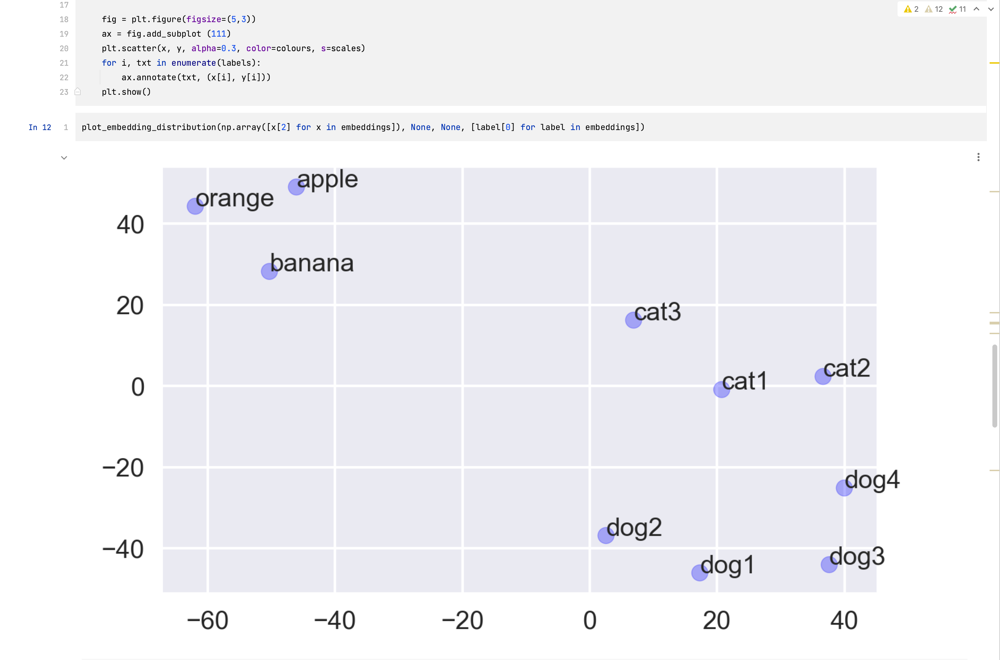
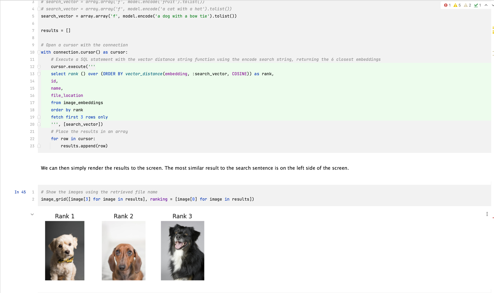

# Oracle Database 23ai AI Vector Search Examples
The notebooks used in this repository demonstrate some simple examples of the use of embeddings/vectors for similarity searches. The code is intended to demonstate the concepts at a very high level. The examples use Oracle Database 23ai's new AI Vector Search functionality to search for similar images using natural language. The model used in the examples is the clip-ViT-B-32 model. This is an Image and Text model, which maps text and images to a shared vector space. This allows us to ask questions in natural language and return images in response. The python code uses the oracledb thin driver to store the embeddings in Oracle Database 23ai in the new Vector datatype and retrieve them with SQL ordering them based on a new function that determines their similarity based on their distance from one another.

The examples use Python (3.11), Pytorch (a Machine Learning Library), SentenceTransformer (A tool to generate text and image embeddings based on Pytorch) and a few other utilities (PIL, Matplotlib, Numpy) to help display some of the objects we'll be using.

